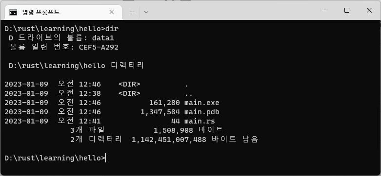
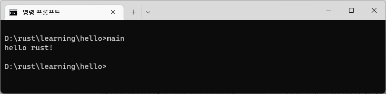

# 러스트 예제코드 만들어 보기

대부분의 언어를 학습할때 처럼 우리도 러스트를 이용하여 헬로우월드 프로그램을 하나 만들어 보도록 하겠습니다.

예제코드를 작성할 적절한 폴더을 하나 준비해 주세요.  필자는 `d:\rust\learning` 경로에서 주로 작업을 할 것입니다.

<br>

## 첫번째 코드

실습 폴더에서 `hello` 폴더를 하나 생성합니다. 생성한  `hello` 폴더 안에서 `main.rs` 파일을 하나 생성합니다. 이때, 파일 확장자 `.rs`는 러스트 확장자 입니다.

```rust
fn main() {
    println!("hello rust!");
}
```

 

- 러스트는 `main`함수를 시작 포인트로 동작합니다.
- 함수를 선언할때는 약자인 `fn` 예약어를 사용합니다.
- 화면에 어떠한 문자열을 출력할때는 `println!` 함수를 사용합니다. 

<br>

## 컴파일하기


작성한 코드를 컴파일 합니다.

```
D:\rust\learning\hello>rustc main.rs
```

아무런 메시지 없이 컴파일이 되었다면, 정상입니다.  이제 컴파일 잘되어서 실행파일이 생성이 되었는지 확인을 해봅니다.





<br>

## 실행하여 결과 확인하기

컴파일 후에 `main.exe` 파일이 생성된 것을 확인 합니다. exe 파일을 실행해 봅니다.





우리가 작성한 문자열이 출력되는 것을 확인 합니다.

축하합니다. 우리의 첫번째 러스트 프로그램을 성공적으로 만들었습니다.

