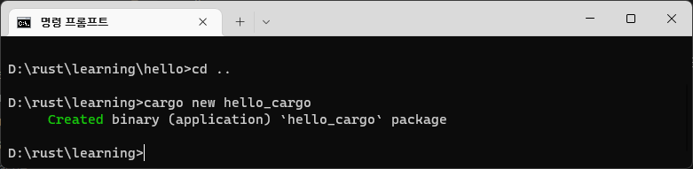
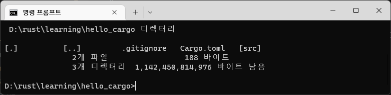
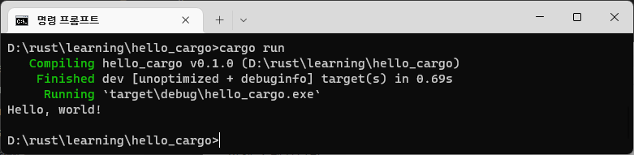

# 러스트 프로젝트


## 프로젝트 생성하기

cargo를 이용하여 러스트 프로젝트를 생성하여 프로그램을 작성할 수 있습니다.


```
cargo new hello_cargo
```


다음과 같이 cargo를 이용하여 프로젝트 폴더가 생성된 것을 확인합니다.





목록을 확인해 봅시다.



```
 D:\rust\learning\hello_cargo 디렉터리

[.]          [..]         .gitignore   Cargo.toml   [src]
               2개 파일                 188 바이트
               3개 디렉터리  1,142,450,814,976 바이트 남음
```


프로젝트 실행을 위한 여러가지 폴더와 파일들이 같이 생성된 것을 확인합니다. 소스코드는 src 폴더 안에 존재합니다.


## 프로젝트 컴파일 하기

현재 프로젝트 폴더 안에서 `cargo run` 명령을 실행합니다.



```
D:\rust\learning\hello_cargo>cargo run
   Compiling hello_cargo v0.1.0 (D:\rust\learning\hello_cargo)
    Finished dev [unoptimized + debuginfo] target(s) in 0.69s
     Running `target\debug\hello_cargo.exe`
Hello, world!
```


위와 같이 cargo는 프로젝트안에 있는 러스트 파일을 `컴파일` 하고 `실행결과`도 같이 출력합니다.


컴파일 후에 폴더의 내용을 다시한번 확인해 보도록 합니다.

```
 D:\rust\learning\hello_cargo 디렉터리

[.]          [..]         .gitignore   Cargo.lock   Cargo.toml   [src]
[target]
               3개 파일                 343 바이트
               4개 디렉터리  1,142,449,045,504 바이트 남음
```


프로젝트를 컴파일 하게 되면 몇개의 파일과 폴더가 더 생성이 됩니다.  컴파일된 실행 파일은 `/target/debug` 폴더 안에 exe 파일이 존재하는 것을 확인 할 수 있습니다.


```
 D:\rust\learning\hello_cargo\target\debug 디렉터리

[.]               [..]              .cargo-lock       [.fingerprint]
[build]           [deps]            [examples]        hello_cargo.d
hello_cargo.exe   hello_cargo.pdb   [incremental]
               4개 파일           1,550,436 바이트
               7개 디렉터리  1,142,449,045,504 바이트 남음
```

