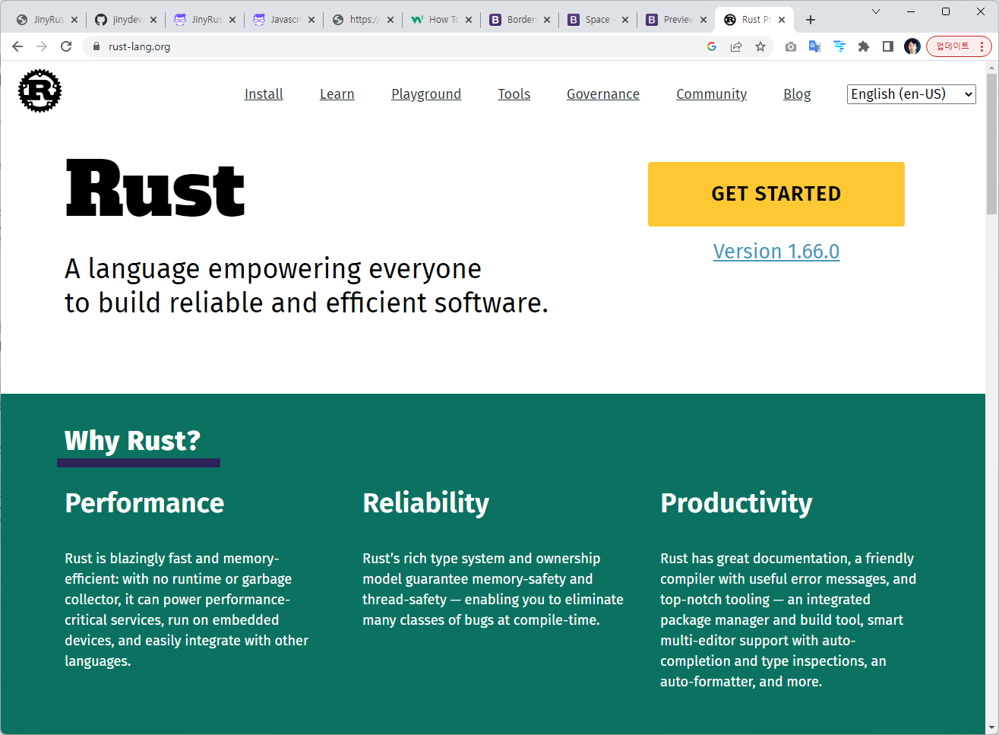
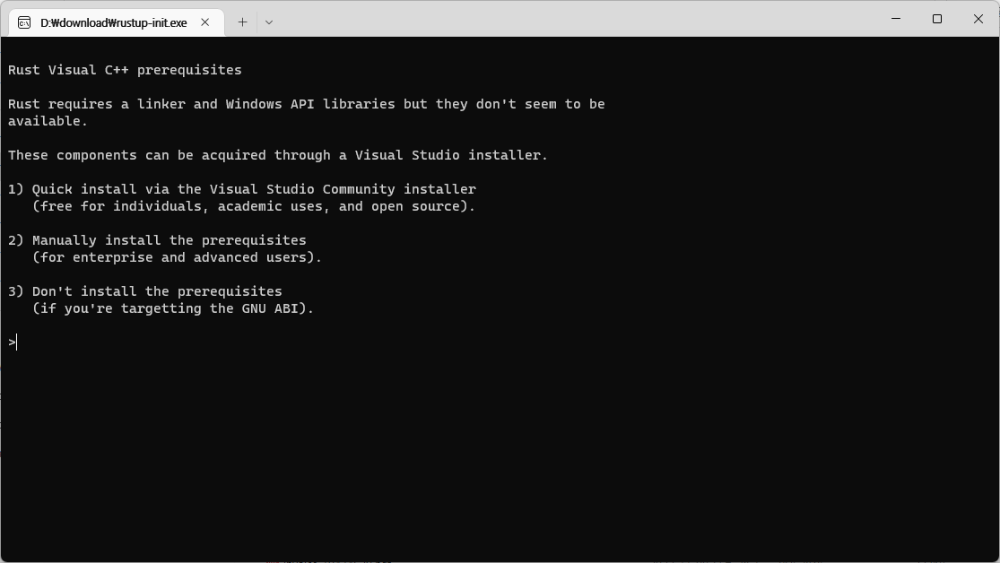
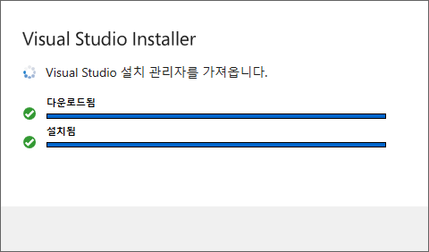
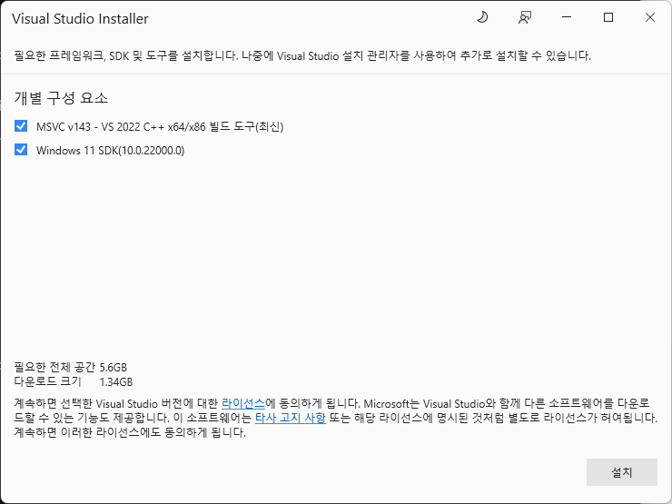
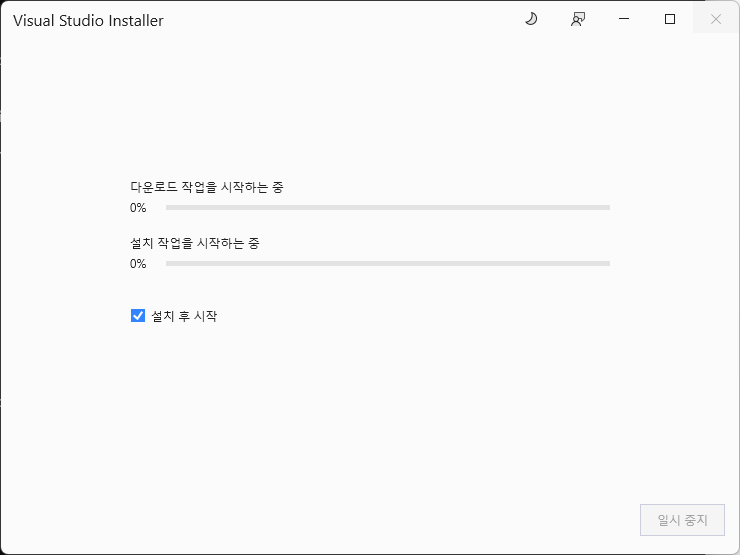
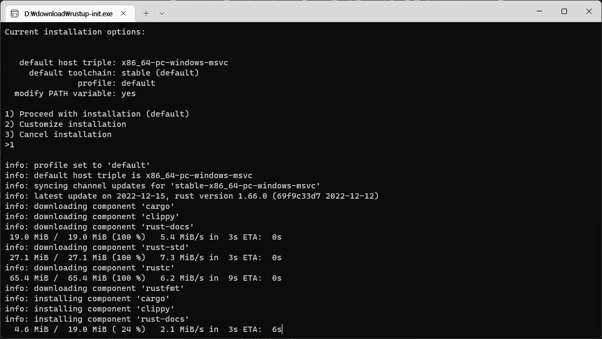
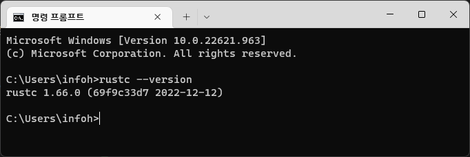
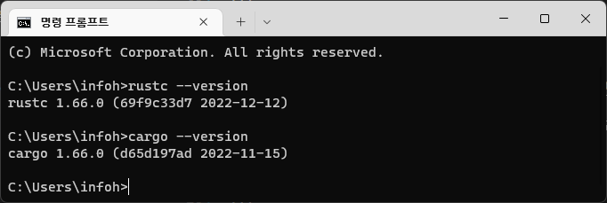

# 러스트 윈도우 설치
`https://rustup.rs` 에서 `install`메뉴를 선택합니다. 윈도우 전용 설치 프로그램 `rustup-init.exe` 파일을 다운로드 받습니다.
다운로드 파일을 실행해 주세요.

<jiny-book-mark>공식사이트</jiny-book-mark>




<jiny-book-mark>Rustup</jiny-book-mark>

## 1.Rustup-init 실행하기
rustup은 윈도우 터미널창에서 실행이 됩니다. 설치 방법을 선택합니다.





추가적으로 C++ 빌드툴이 필요합니다. 이를 위하여 visual studio가 같이 필요로 합니다. `1`을 선택하면 자동으로 비쥬얼 스튜디오 무료 버젼인 커뮤니티 에디션이 자동으로 설치 됩니다. 이 과정에서 약간의 시간이 필요로 합니다.


<jiny-book-mark>비쥬얼스튜디오</jiny-book-mark>

## 2.Visual studio 설치하기

러스트를 설치하기 위해서는 비쥬얼 스튜디오가 같이 필요합니다.  비쥬얼 스튜디오 설치 관리자를 다운로드 받습니다. `1`을 선택하면 자동으로 설치 관리자를 받을 수 있습니다.



추가 도구를 같이 설치 합니다. `설치`를 선택해서 계속 진행해 주세요.



다운로 드 및 설치가 계속 진행됩니다. 이부분은 시간이 많이 소요가 되니 인내심을 가지고 천천히 진행해 주시길 바랍니다.



<jiny-book-mark>러스트 설치</jiny-book-mark>

## 3. 러스트 설치 다시 실행하기

필요한 C++ 빌드업 툴인 비쥬얼 스튜디오를 설치했다면, 다시 러스트 설치 프로그램을 계속 진행합니다.





`1`번을 선택해서 계속 진행을 해주세요.

<jiny-book-mark>설치확인</jiny-book-mark>

## 4. 설치확인

러스트가 잘 설치 되었는지 확인을 합니다. 윈도우에서 `cmd` 터미널 창을 실행합니다. `--version` 옵션을 이용하여 설치가 잘 되었는지 확인합니다.

```
rustc --version
```

다음과 같이 출력이 되는지 확인 합니다.



러스트 패키지 관리자인 Cargo도 같이 잘 설치가 되었는지 확인을 해봅니다.

```
cargo --version
```


축하합니다. 이제 러스트 프로그램을 위한 도구 설치가 완료 되었습니다. 이제 차근 차근 한단계식 러스트를 학습해 보도록 합니다.


